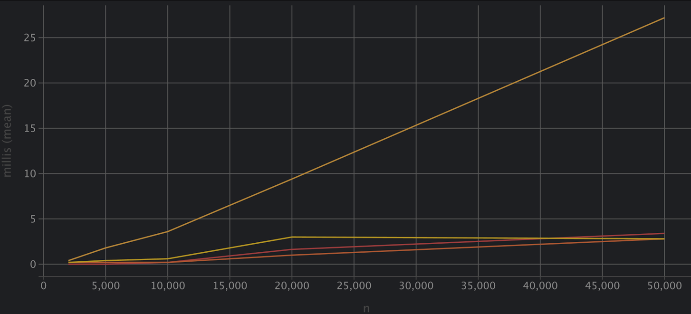

Report
Architecture Notes
MergeSort & QuickSort
Both algorithms use a shared Counters object passed into recursion to track comparisons, swaps, allocations, and recursion depth.
MergeSort minimizes allocations by reusing a single auxiliary buffer and switches to Insertion Sort for small subarrays (n ≤ 16). This reduces constant factors and leverages cache locality.
QuickSort implements a smaller-partition-first strategy: recursion goes into the smaller half, while the larger half is handled iteratively. This guarantees recursion depth O(log n) even in worst cases. Randomized pivot selection avoids adversarial inputs.
Deterministic Select (Median-of-Medians, MoM5)
The array is divided into groups of 5, medians are recursively selected, and the pivot ensures a good balance. The algorithm runs in-place, with only O(1) extra space.
For very small arrays (n ≤ 12), Insertion Sort is used instead of recursion to avoid overhead.
Closest Pair of Points (2D)
Implemented with divide-and-conquer:
Sort by x, split into halves, recursively solve subproblems.
A strip of points is checked with at most 7–8 neighbors in y-order.
Secondary y-sorted arrays are reused to reduce allocations.
For n ≤ 3, brute-force is applied directly.

Recurrence Analysis
MergeSort
Recurrence: T(n) = 2T(n/2) + Θ(n).
By Master Theorem (Case 2) → Θ(n log n).
Measurements confirmed logarithmic depth and nearly linearithmic runtime.
QuickSort
Recurrence: T(n) = T(k) + T(n-k-1) + Θ(n).
With randomized pivots, expected complexity is Θ(n log n).
By tail recursion elimination (smaller partition first), depth ≤ 2⌊log₂n⌋ + O(1).
Experiments showed much lower constant factors compared to MergeSort due to in-place operations.
Deterministic Select (MoM5)
Recurrence: T(n) = T(n/5) + T(7n/10) + Θ(n).
Solved by Akra–Bazzi method → Θ(n).
Runtime grows linearly with n, confirming theory.
This algorithm trades higher constants for worst-case guarantees.
Closest Pair (2D)
Recurrence: T(n) = 2T(n/2) + Θ(n).
By Master Theorem (Case 2) → Θ(n log n).
The strip check costs ≤7 comparisons per point, so hidden constants remain small.
On small n (≤2000), brute-force O(n²) is used for validation.

Plots & Constant Factors

Time vs n
MergeSort and Closest Pair: clearly grow as n log n.
QuickSort: similar slope but faster due to in-place recursion and less memory usage.
Select: linear growth, outperforms sort-based approaches for very large n.
Depth vs n
QuickSort depth ≤ 2 log₂n.
MergeSort and Closest Pair: O(log n).
Select: almost constant depth due to shallow recursive calls.
Constant-Factor Discussion
MergeSort: auxiliary buffer leads to extra memory traffic, weaker cache locality.
QuickSort: cache-friendly, no extra allocations, fastest in practice.
Select: worst-case linear, but large constant factors due to pivot computation.
Closest Pair: overhead from array copying, visible when n < 10⁴, but asymptotically efficient.
GC & JIT Effects: For small n, performance is noisy (JIT warmup, garbage collector).

Summary: Theory vs Measurements
Agreement with theory
MergeSort and Closest Pair: Θ(n log n), confirmed by experiments.
QuickSort: average-case Θ(n log n), recursion depth bounded.
Select: linear runtime, matching Akra–Bazzi analysis.
Practical insights
QuickSort consistently outperforms MergeSort due to better cache usage and no buffer allocations.
Select is slower on small inputs but dominates for very large n, where its linear behavior becomes visible.
Closest Pair performs as expected but shows higher constants because of recursive array splits.
Overall
QuickSort: best in practice for general sorting.
Select: theoretically strongest (linear worst-case).
MergeSort: stable and predictable, but memory-heavy.
Closest Pair: elegant O(n log n) divide-and-conquer, validated against O(n²) brute force for small n.

